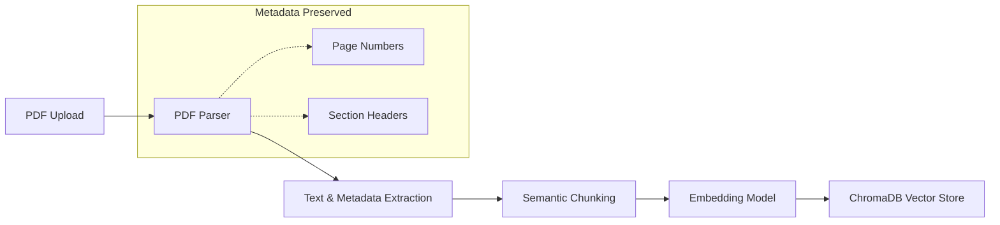
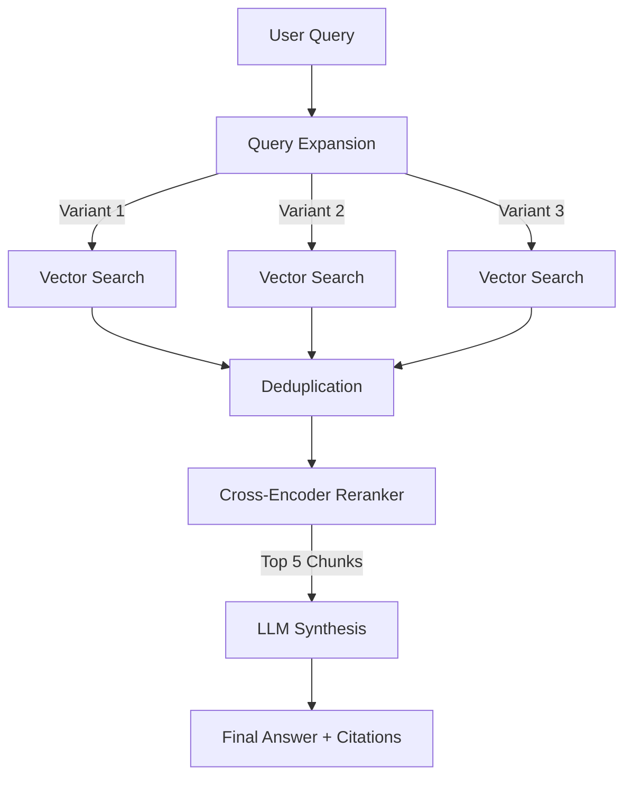

# Research Paper RAG Assistant

A production-grade Research Assistant built with **Deep RAG (Retrieval-Augmented Generation)** for analyzing academic papers. This system is designed to provide high-fidelity, citation-grounded answers to complex research questions by leveraging advanced ingestion and retrieval pipelines.

## Features

### Backend (FastAPI + Python)
- **High-Fidelity Ingestion**: Parses PDFs while preserving page numbers and section headers (Abstract, Introduction, Methods, etc.) using `PyMuPDF`.
- **Semantic Chunking**: Implements a sliding window strategy (400 tokens chunk, 50 tokens overlap) to maintain context across sentence boundaries.
- **Deep RAG Pipeline**:
  - **Query Expansion**: Generates 3 semantic variants of every user query to maximize retrieval recall.
  - **Parallel Vector Search**: Executes searches for all query variants simultaneously.
  - **Cross-Encoder Reranking**: Re-scores the top retrieved chunks using a BERT-based Cross-Encoder to ensure high relevance.
  - **Citation-Grounded Synthesis**: Answers are generated with strict citations pointing to specific pages and sections.
- **Knowledge Graph**: Extracts key concepts and their relationships from papers for visualization.

### Frontend (Next.js 16 + React 19)
- **Modern Academic UI**: Three-panel layout (Papers, Chat, Context) designed for deep work.
- **Real-time Chat**: Streaming responses with immediate citation linking.
- **Interactive Citations**: Clicking a citation opens the PDF to the exact page.
- **Knowledge Graph**: Visual exploration of concepts using force-directed graphs.
- **PDF Viewer**: Integrated PDF viewer for seamless verification.

## Architecture

### Ingestion Pipeline
The ingestion process transforms raw PDFs into a searchable vector index with rich metadata.



1.  **PDF Parsing**: Files are processed using `fitz` (PyMuPDF). We use heuristics to detect section headers (e.g., "Introduction", "Results") and associate them with text.
2.  **Chunking**: Text is split into sentence-aware chunks (400 tokens) with a sliding window overlap (50 tokens) to prevent losing context at cut-offs.
3.  **Embedding**: Chunks are encoded into 384-dimensional vectors using `sentence-transformers/all-MiniLM-L6-v2`.
4.  **Storage**: Vectors and metadata are stored in a local `ChromaDB` instance.

### Retrieval Pipeline (Deep RAG)
The retrieval process is optimized for precision and recall using a multi-stage approach.



1.  **Query Expansion**: The system uses GPT-4o-mini to generate 3 alternative phrasings of the user's question (e.g., "What are the limitations?" -> "Discuss the drawbacks and future work mentioned").
2.  **Parallel Retrieval**: All 3 variants are embedded and used to query ChromaDB in parallel, retrieving the top 20 candidates for each.
3.  **Deduplication**: Duplicate chunks (found by multiple variants) are merged.
4.  **Reranking**: The unique set of candidates is passed to a Cross-Encoder (`cross-encoder/ms-marco-MiniLM-L-6-v2`). This model reads the query and chunk pairs together to predict a relevance score.
5.  **Synthesis**: The top 5 highest-scoring chunks are fed to the LLM. The system prompt enforces strict citation formats `[Source X]`.

## Tech Stack

### Backend
-   **Framework**: FastAPI
-   **Lang**: Python 3.10+
-   **Vector DB**: ChromaDB
-   **PDF Engine**: PyMuPDF (fitz)
-   **Embeddings**: SentenceTransformers (`all-MiniLM-L6-v2`)
-   **Reranker**: CrossEncoder (`ms-marco-MiniLM-L-6-v2`)
-   **LLM**: OpenAI GPT-4o-mini
-   **Graph**: NetworkX (for graph construction logic)

### Frontend
-   **Framework**: Next.js 16 (App Router)
-   **Library**: React 19
-   **Language**: TypeScript
-   **Styling**: Tailwind CSS v4
-   **Components**: shadcn/ui
-   **Icons**: Lucide React
-   **Visualization**: Recharts (charts), D3.js/React-Force-Graph (knowledge graph)

## Getting Started

### Prerequisites
-   Python 3.10 or higher
-   Node.js 18 or higher
-   OpenAI API Key

### Backend Setup

1.  Navigate to the backend directory:
    ```bash
    cd backend
    ```

2.  Create a virtual environment:
    ```bash
    python -m venv venv
    source venv/bin/activate  # On Windows: venv\Scripts\activate
    ```

3.  Install dependencies:
    ```bash
    pip install -r requirements.txt
    ```

4.  Configure environment variables:
    ```bash
    cp .env.example .env
    ```
    Open `.env` and add your OpenAI API key:
    ```env
    OPENAI_API_KEY=sk-your-key-here
    ```

5.  Start the API server:
    ```bash
    uvicorn app.main:app --reload --port 8000
    ```
    The API docs will be available at `http://localhost:8000/docs`.

### Frontend Setup

1.  Navigate to the root directory (where package.json is):
    ```bash
    cd ..  # If you are in backend/
    ```

2.  Install dependencies:
    ```bash
    npm install
    ```

3.  Start the development server:
    ```bash
    npm run dev
    ```

4.  Open the application:
    Visit `http://localhost:3000` in your browser.

## API Endpoints

| Method | Endpoint | Description |
|--------|----------|-------------|
| **POST** | `/api/ingest/upload` | Upload and process a PDF file |
| **POST** | `/api/chat/query` | Send a query to the RAG system |
| **GET** | `/api/papers/list` | List all uploaded papers |
| **GET** | `/api/papers/{id}/chunk` | Get parsed chunks for a specific paper |
| **GET** | `/api/graph/{id}` | Get knowledge graph data for a paper |
| **GET** | `/health` | Check API status |

## Usage Guide

1.  **Upload**: Click the "Upload PDF" button in the sidebar to add research papers. Wait for the processing to complete.
2.  **Explore**: Use the "Graph" tab to see extracted concepts and how they connect.
3.  **Chat**: Type your research question in the chat bar.
    -   *Example*: "What method did the authors use for evaluation?"
    -   *Example*: "Compare the results of model A and model B."
4.  **Verify**: Click on any `[Source 1]` citation in the answer to open the PDF at the exact page where the information was found.

## License
MIT
