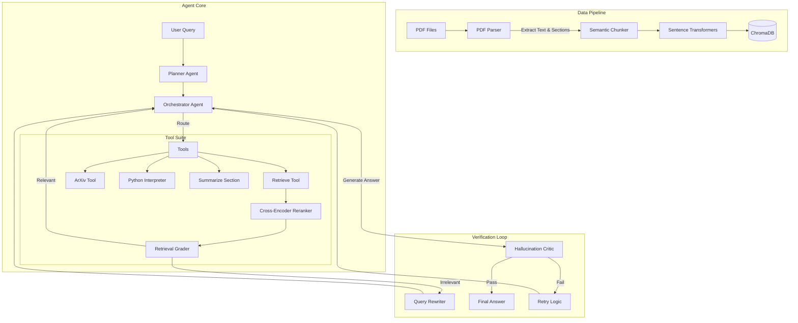
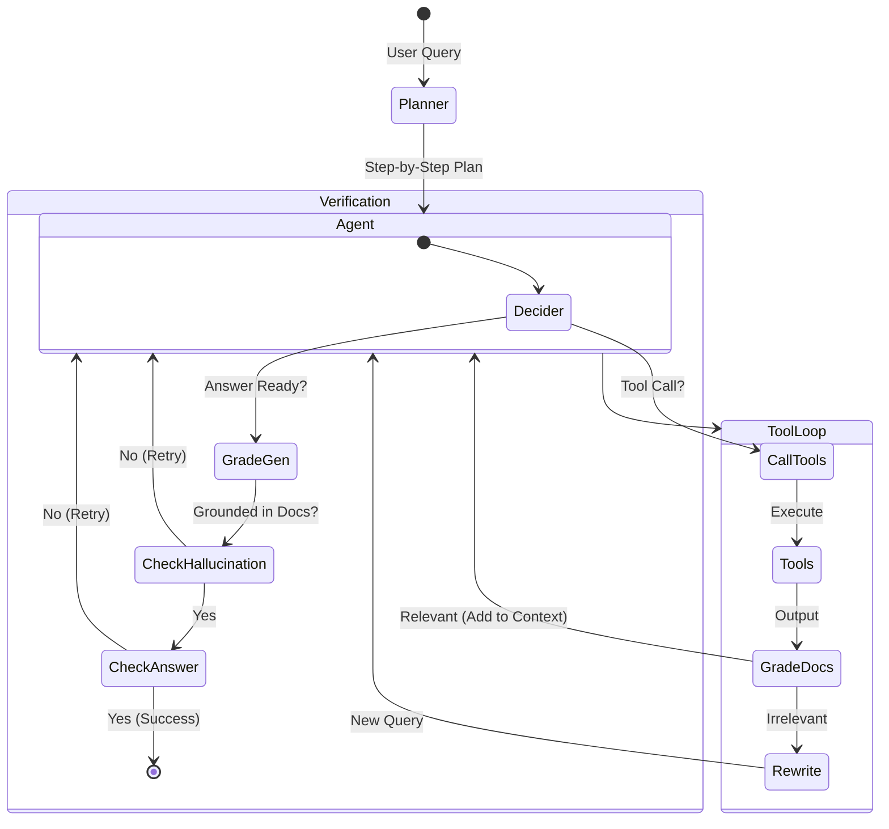

# Deep Agentic RAG for Research Papers

A production-grade, autonomous research assistant designed for rigorous scientific inquiry. This system goes beyond standard RAG by employing multi-step planning, iterative verification, and section-aware semantic understanding to provide evidence-backed answers from complex academic literature.

## 1. Project Overview

### The Problem
Traditional RAG (Retrieval-Augmented Generation) pipelines often fail in research contexts because:
1.  **Semantic Flattening**: They treat "Methods" and "Results" as equal text chunks, losing the logical structure of a paper.
2.  **Single-Hop Myopia**: They cannot trace reasoning chains that span multiple papers or sections (e.g., matching a method in Paper A to a result in Paper B).
3.  **Hallucination Risk**: Standard LLMs often fill in missing details with plausible-sounding but fabricated citations.

### The Solution: Deep Agentic RAG
This system implements a **"Plan-Execute-Verify"** architecture inspired by recent advances in agentic AI. Instead of simply prepending context to a prompt, it:
*   **Plans**: Decomposes complex queries into logical steps (e.g., "Find the method," then "Compare accuracy," then "Check for contradictions").
*   **Reasons**: Uses a dedicated Python interpreter for numerical claims to ensure mathematical correctness.
*   **Verifies**: Employing a "Critic" agent that grades every retrieved chunk for relevance and every generated answer for hallucination against the source text.
*   **Structures**: Ingests papers not as blobs of text, but as structured semantic entities (Abstract, Methods, Results, Discussion).

## 2. Key Contributions

*   **Agentic Orchestration with LangGraph**: A cyclic graph architecture where agents can loop, retry, and rewrite queries based on feedback, rather than a linear DAG.
*   **Section-Aware Ingestion**: A custom PDF parsing pipeline (`pdf_parser.py`) that identifies and tags content by section (e.g., `section: "Methods"`), enabling scoped queries like *"Summarize the ablation studies in the Results section"*
*   **Triple-Step Verification**:
    1.  **Retrieval Grading**: Filters irrelevant noise before it reaches the context window.
    2.  **Hallucination Grading**: Verifies that every claim in the answer is supported by the retrieved context.
    3.  **Answer Grading**: Ensures the verified answer actually addresses the user's core question.
*   **Hybrid Tool Use**: Seamlessly switches between local vector search, arXiv for external literature, and a Python sandbox for data analysis.

## 3. High-Level System Architecture

The system is built on a modular microservices architecture, separating rigorous data processing from agentic reasoning.



## 4. End-to-End Workflow

The following state machine represents the lifecycle of a single user query through the `langgraph` workflow.



## 5. Document Ingestion Pipeline

The ingestion pipeline (`app.core`) transform raw PDFs into highly structured, queryable knowledge.

1.  **PDF Parsing (`pdf_parser.py`)**:
    *   Uses `PyMuPDF` (fitz) for page-level text extraction.
    *   **Heuristic Section Classification**: Scans distinct keywords (e.g., "Introduction", "Materials and Methods") to assign a `section` metadata tag to every text block.
    
2.  **Semantic Chunking (`chunking.py`)**:
    *   Splits text into sentences first, then aggregates them into chunks (default 400 tokens).
    *   **Constraint**: Chunks never cross section boundaries. A chunk is strictly "Methods" or "Results", never a mix, preventing context contamination.
    
3.  **Embedding & Storage**:
    *   Embeds chunks using `all-MiniLM-L6-v2`.
    *   Stores rich metadata in ChromaDB: `{source, page, section, paper_id}`.

## 6. Models Used

| Component | Model / Technology | Justification | Alternatives Considered |
| :--- | :--- | :--- | :--- |
| **Reasoning Engine** | `gpt-4.1-mini` | High speed and reduced cost for iterative agent loops (planning, grading). | `gpt-4-turbo` (slower), `claude-3-haiku` |
| **Embedding Model** | `sentence-transformers/all-MiniLM-L6-v2` | Excellent balance of performance and speed for local inference; widely benchmarked. | `openai-text-embedding-3-small` (requires API call) |
| **Reranker** | `cross-encoder/ms-marco-MiniLM-L-6-v2` | Significantly boosts precision by scoring query-doc pairs directly. | Cohere Rerank (API dependency) |
| **Search Provider** | Google Serper | Reliable, low-latency search for external grounding. | Tavily, Bing Search |

## 7. Retrieval Strategy

The system employs a **Retrieve-and-Rerank** strategy with intelligent query expansion.

1.  **Dense Retrieval**: Initial KNN search in ChromaDB using cosine similarity (`Top-K=20`).
2.  **Cross-Encoder Reranking**: The top 20 candidates are passed to a Cross-Encoder, which inputs `(query, document_text)` and outputs a relevance score. This is computationally more expensive but filters out "distractor" chunks that share keywords but not meaning.
3.  **Query Transformation**: If retrieved documents are graded as `irrelevant`, the **Rewriter Agent** reformulates the query (e.g., adding synonyms, breaking down complex questions) before retrying.

## 8. Agent Design

The system consists of specialized agents coordinated by `langgraph`:

*   **Planner Agent**:
    *   **Input**: Raw user query.
    *   **Role**: Decomposes the query into a list of executed steps.
    *   **Output**: A structured plan (e.g., `["Search for X", "Calculate Y", "Compare Z"]`) injected into the system prompt.

*   **Orchestrator Agent**:
    *   **Input**: History of messages + Current Plan.
    *   **Role**: The "Executor". Decides whether to call a tool or generate a final answer.
    *   **Tools**: Access to `retrieve_tool`, `arxiv_tool`, `python_interpreter`, and `web_search`.

*   **Graders (Critics)**:
    *   **Retrieval Grader**: Binary 'yes/no' on whether a document helps answer the specific question.
    *   **Hallucination Grader**: 'yes/no' on whether the final generation is fully supported by the retrieved set.
    *   **Answer Grader**: 'yes/no' on whether the grounded answer actually satisfies the user's intent.

## 9. Verification & Hallucination Control

This is the core reliability mechanism. Most RAG systems trust the LLM's final generation. We do not.

1.  **The Hallucination Test**: After the Orchestrator generates an answer, the **Hallucination Grader** compares it against the set of retrieved documents. 
    *   *Logic*: If the answer contains specific claims (numbers, citations) not present in the documents, it is marked as a hallucination.
    *   *Action*: The system rejects the answer and typically retries with a penalty or stricter prompt.
    
2.  **The Relevance Test**: If the Hallucination Test passes, the **Answer Grader** checks if the answer references the user's original question.
    *   *Why?* An answer can be factually true (grounded) but irrelevant (e.g., answering "The sky is blue" to "What is the accuracy?").

## 10. Memory & State Management

*   **State Schema**: The `AgentState` tracks the conversation history (`messages`), the `plan`, and verification flags (`is_supported`, `retry_count`).
*   **Checkpointing**: Uses `langgraph.checkpoint.memory.MemorySaver` to persist state between turns, enabling the user to ask follow-up questions without losing context of the analyzed papers.

## 11. Why This System Is Useful

*   **Systematic Literature Review**: Can ingest 20 papers and answer "Compare the learning rates used in all method sections," which manual reading might miss.
*   **False Positive Reduction**: The verification loop actively fights the tendency of LLMs to "pleaase the user" with invented facts.
*   **Math-Awareness**: Unlike text-only RAG, the Python tool allows for verifying statistical significance or re-plotting data directly from the paper's descriptions.

## 12. Evaluation Strategy

To maintain research-grade standards, we evaluate on:
*   **Faithfulness**: % of claims in the answer supported by citations.
*   **Answer Relevancy**: Semantic similarity between the generated answer and the core question query.
*   **Context Precision**: How many of the retrieved chunks were actually useful (measured by the Retrieval Grader's acceptance rate).

## 13. Limitations & Open Research Problems

*   **Table Parsing**: PDF tables are currently ingested as raw text. Complex multi-column tables may be poorly semantically chunked.
*   **Multi-Modal Graphs**: The system does not yet "see" figures or charts, relying only on captions and textual descriptions.
*   **Citation Graphs**: We rely on semantic similarity, not the explicit citation network (who cited whom), which is a valuable signal for paper relevance.

## 14. Upcoming Features

*   **Graph-RAG Integration**: Building a Knowledge Graph of entities (Authors, Methods, Metrics) to traverse relationships explicitly.
*   **Visual-RAG**: Using Multi-Modal LLMs (like GPT-4o) to interpret plots and diagrams directly.
*   **Latex Reconstruction**: Rebuilding exact formulas from PDF text for higher-fidelity math answers.

## 15. How to Run

1.  **Environment Setup**: Clone the repo and install dependencies (poetry or pip).
2.  **Configuration**: Create a `.env` file with your `OPENAI_API_KEY` and optional `SERPER_API_KEY`.
3.  **Database Init**: The system will automatically create a local `chroma_db` on first run.
4.  **Launch**:
    *   Backend: Run the FastAPI server via `uvicorn`.
    *   Frontend: Run the React interface via `npm start`.

## 16. Citation

If you use this architecture in your research, please cite:

```bibtex
@software{DeepAgenticRAG2026,
  author = {Project Contributors},
  title = {Deep Agentic RAG: A Self-Correcting Research Assistant},
  year = {2026},
  publisher = {GitHub},
  url = {https://github.com/dineshmc1/rag-based-research-paper-assistant}
}
```
